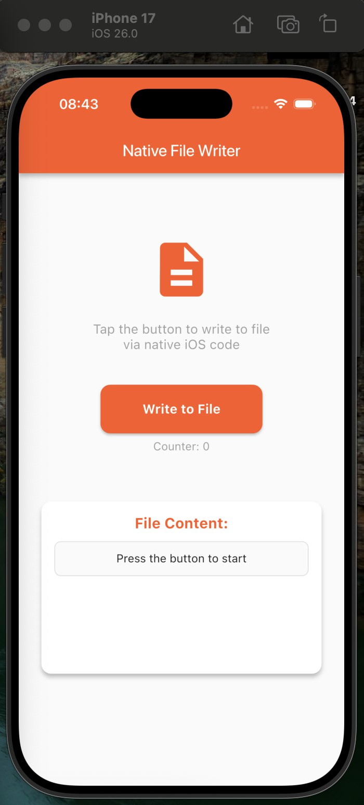
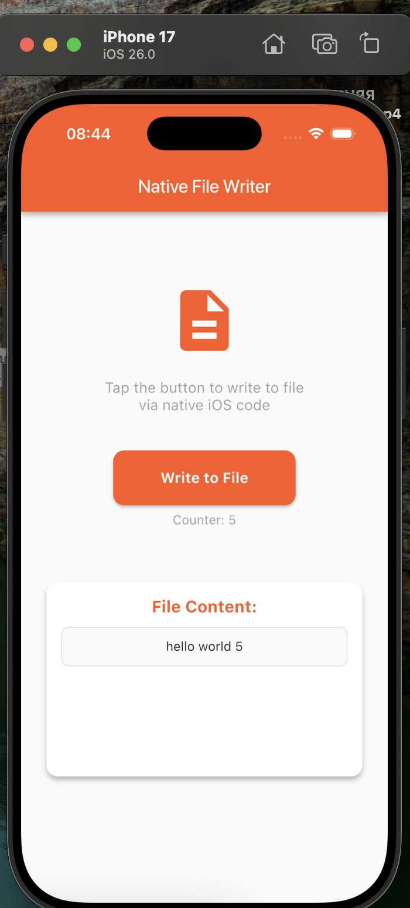

```markdown
# Native File Writer App

A Flutter application with native iOS integration that demonstrates writing to files using Swift and MethodChannel. The app features a simple counter that writes "hello world N" to a text file with each button press.

## 📱 Demo

### Initial State


### After Multiple Clicks  


## 🚀 Features

- **Native iOS Integration**: Uses MethodChannel to communicate with Swift code
- **File Operations**: Writes and reads from text files using native iOS APIs
- **Real-time Updates**: Displays file content immediately after each write operation
- **Clean Architecture**: Built with BLoC state management and feature-first structure
- **Error Handling**: Robust error handling for file operations

## 🛠️ Installation & Setup

### Prerequisites

- Flutter 3.0 or higher
- Xcode 15.0 or higher (for iOS builds)
- iOS Simulator or physical iOS device

### Quick Start

1. **Clone the repository**
   ```bash
   git clone https://github.com/your-username/native-file-writer.git
   cd native-file-writer
   ```

2. **Install dependencies**
   ```bash
   flutter pub get
   ```

3. **Setup iOS dependencies**
   ```bash
   cd ios
   pod install
   cd ..
   ```

4. **Run the application**
   ```bash
   flutter run
   ```

## 🎯 How to Use

1. **Launch the App**: Open the app to see the initial screen with counter at 0
2. **Press the Button**: Tap "Write to File (N=0)" to increment the counter
3. **View Results**: Watch as:
   - Counter increases (N=1, N=2, N=3...)
   - File content updates in real-time
   - "hello world N" lines accumulate in the display
4. **Continue Writing**: Each press adds a new line to the file
